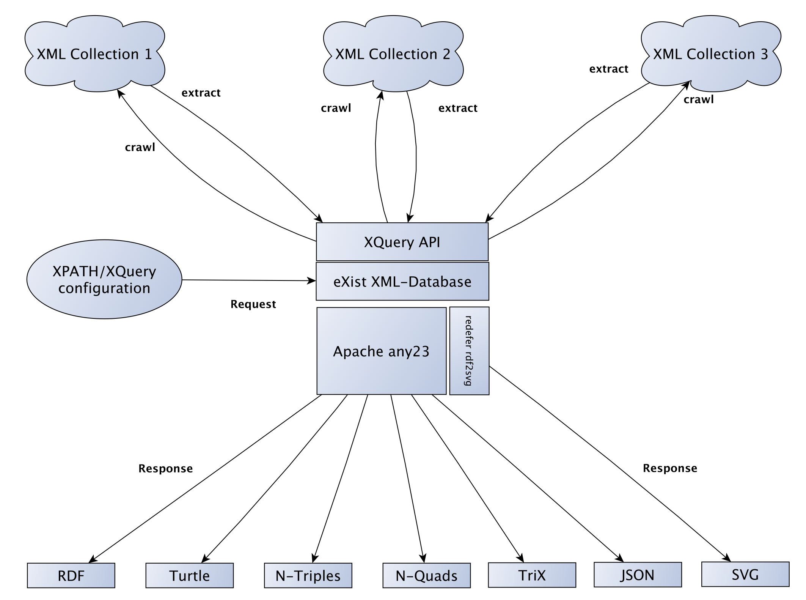

# XTriples

## A generic webservice to extract RDF statements from XML resources.

Check out the demo and documentation at http://xtriples.spatialhumanities.de

With this webservice you can crawl XML repositories and extract RDF statements 
using a simple configuration based on XPATH expressions.

This repository contains the source code of the XTriples webservice.

The webservice is distributed as a single .xar file, which can be installed into an eXist-db instance via the package manager.

You can download the latest version right here: http://download.spatialhumanities.de/ibr/xtriples-1.3.0.xar

Read the documentation on how to setup your own instance of XTriples: http://xtriples.spatialhumanities.de/documentation.html#setup

## Building

To build the .xar yourself, you need to have Apache Ant installed. Alternatively you can use the Ant version which comes with eXist-db 
(call build.sh/build.bat from the eXist-db directory). 

Clone this repository to a local directory:

	git clone https://github.com/spatialhumanities/xtriples.git xtriples

Change into the created directory and call

	ant

This should create a .xar file in the build directory.

## Credits

Released under MIT license.
@author: <a href="http://www.adwmainz.de/mitarbeiter/profil/torsten-schrade.html">Torsten Schrade</a> (<a href="https://github.com/metacontext">@metacontext</a>)